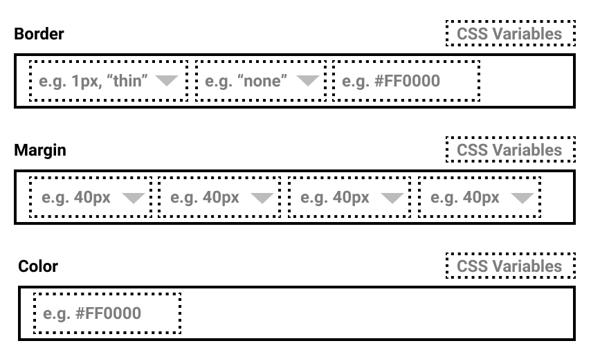

**Status**: Draft

# Abstract

The CSS controls consist of an abstract control and two extended controls, CSS styles and CSS stylesheets. These controls will provide a way to interpret CSS strings for inline (styles) and CSS stylesheets into form UI and back to strings.

## Data import

The CSS data will be imported from `@microsoft/design-to-code`, for more information on the exported data format for this, refer to [the documentation](../../../../design-to-code/src/data-utilities/mapping.mdn-data.md).

## Wireframe

A basic wireframe showing the border, margin and color interpretations:



## Methods

### Render methods

Render methods should be created for form elements. Depending on the type of string these CSS properties ultimately represent, an appropriate form element or set of form elements should be generated.

Further rules will need to be defined based on [MDN CSS syntax](https://github.com/mdn/data/blob/master/css/syntaxes.json).

#### Text field

Used for:
- a default value if the property name is not recognized

Example value:
```css
{
    foo: bar;
}
```

#### Autocomplete dropdown

Used for:
    - the property name selector, once this has been chosen, the value should reflect different inputs
    - color (full list of available colors can be autocompleted)
    - border-style

Example value:
```css
{
    border: solid;
}
```

#### CSS function

When a property can use a `var()`, `calc()` or any other CSS function it should have a way to switch to that input type, presented as a dropdown of available CSS functions, each of which will extend from a `CSSFunction` class. 

Used for:
    - anything which could use a CSS function such as `var()`, `calc()`

```css
{
    color: var(--my-color);
}
```

#### Number field + Autocomplete dropdown

Used for:
    - width (the select will be populated by `px`, `em`, etc.)

```css
{
    width: 20px;
}
```

### Utility methods

Data conversion utilities should exist to transform strings to objects and objects to strings. Objects will be stored as part of the components state, while strings will be returned during update.
Some utilities that may be required:
- `convertObjectToCSS` - convert an object + selectors to a CSS string, if no selectors are available convert it to the inline style equivalent.
- `convertCSSToObject` - convert a string to an object + selectors (if available)

## Overrides

To make this flexible, the class should allow a way to override the default creation of any property. The implementation of this in the CSS styles or CSS stylesheets controls may look like:

```tsx
<CSSControl
    // A subset of CSS properties must be provided, this is done
    // to simplify and reduce package size as the amount of CSS definitions
    // is large.
    css={subsetOfMDNCSSProperties}
    controls={[
        new StandardCSSControlPlugin({
            id: "example-id",
            name: ["border"],
            cssControls: (config) => {
                return (
                    <input
                        type={"text"}
                        onChange={(e) => {
                            config.onChange({
                                ["border"]: e.target.value
                            })
                        }}
                    />
                )
            }
        })
    ]}
/>
```

Note that multiple CSS styles may be overridden, this should allow logical groupings to remain together. An example would be the use of `flexbox` and `CSS grid`. These might provide an opportunity to group CSS together to edit with a single control, as well as the flexibility to allow controls to communicate between instances. An example of this might be that when setting a display to `flex` on a parent container, the immediate children of that container could register that they should include any `flexbox` CSS in a custom UI.

## CSS Styles

The primary goal of the component is to take strings that would conform to CSS inline style properties such as `"border: red; color: green;"` and re-interpret them back out using UI generated by the [render methods](#render-methods).

## CSS Stylesheet

The primary goal of the component is to take strings that would conform to CSS stylesheet properties such as:

```
":host {
    border: red;
    color: green;
}"
```

Then re-interpret them back out using UI generated by the render [Methods](#methods).

For this control there are additional requirements for selectors, whereby the default is the `:host` and futher selectors can be added, as an example:

```css
:host {
    --border-color: red;
    --text-color: green;
}

div {
    border: var(--border-color);
    color: var(--text-color);
}
```

The `:host` should not be editable but other selectors should be text-fields when clicked.

## Additional notes

The purpose of this control is to work in a similar fashion to the developer tools in Chromium. Extending off of this work, the autocomplete dropdowns and number fields should provide a more intuitive UI for users by displaying default values.
